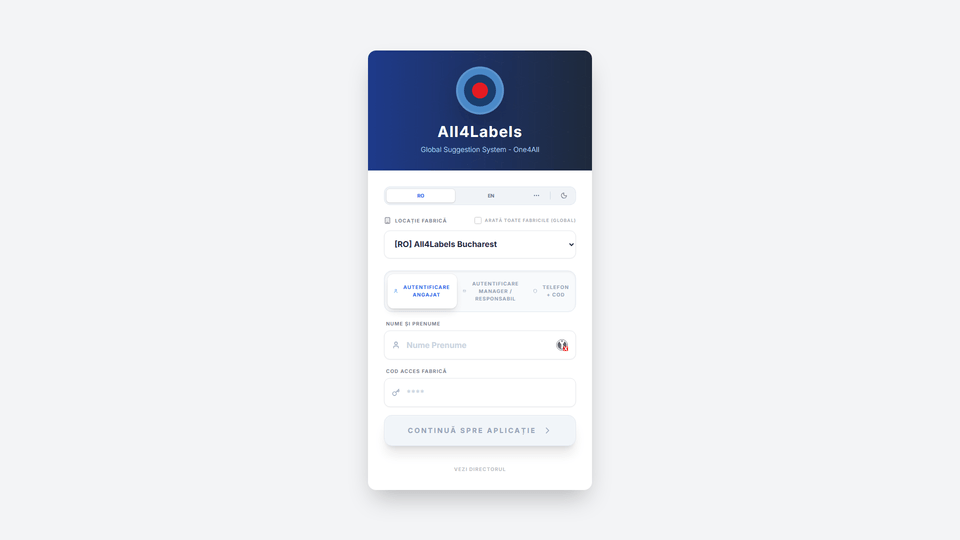
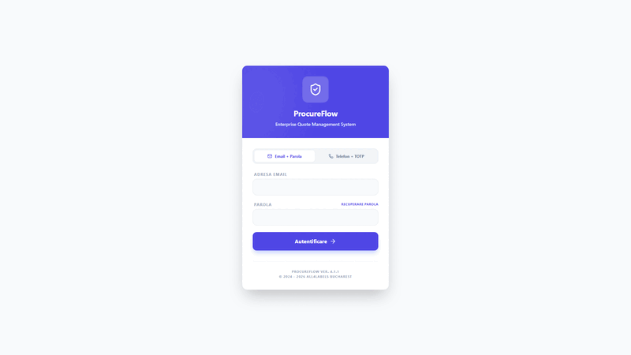
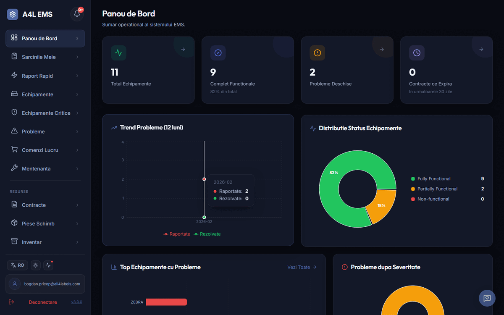
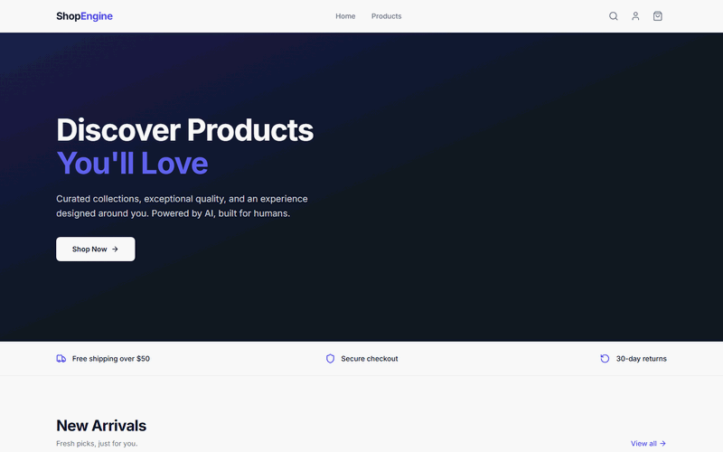
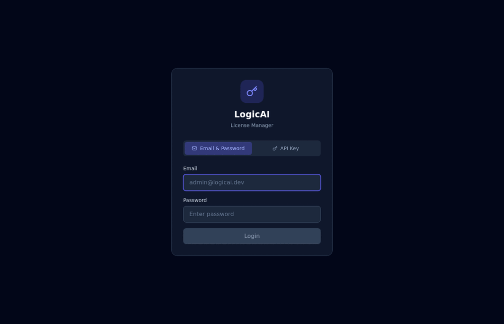
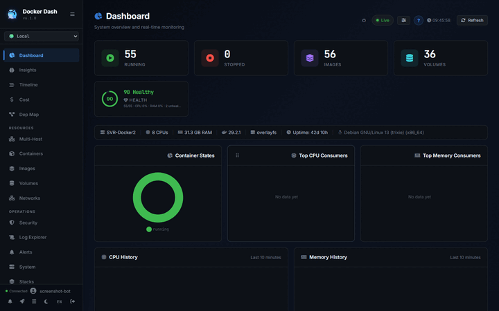

<h1>Hey, sunt Bogdan </h1>

<p>Solo developer · Building full-stack web apps + Windows desktop software + Android Native.<br/>
TypeScript · Node.js · React · MSSQL · Delphi/FMX · Docker · Cloudflare</p>

<p>
  
  
  
  
  
  
  
  
  
</p>

---

## Proiecte active

<table>
<tr>
<td width="50%" valign="top">



**AIR — Global Suggestion System** &nbsp; `private` &nbsp; 

AI-powered suggestion and feedback platform for enterprise teams. Real-time collaboration, voting, status tracking.

`TypeScript` `React` `Express` `MSSQL`

</td>
<td width="50%" valign="top">

<!--  -->


**ProcureFlow — Enterprise Procurement** &nbsp; `private` &nbsp; 

Platforma de procurement cu modul RFQ, integrare eFactura/ANAF, OAuth2, management documente XML/PDF/ZIP, permisiuni granulare. 27 tabele, 70+ stored procedures.

`TypeScript` `MSSQL` `React` `Docker`

</td>
</tr>
<tr>
<td width="50%" valign="top">



**EMS — Equipment Management** &nbsp; `private` &nbsp; 

Sistem de management echipamente pentru o fabrica de etichete. 40+ tabele, 6 roluri RBAC, frontend React 18 in romana, complet containerizat.

`TypeScript` `MSSQL` `React`

</td>
<td width="50%" valign="top">

<!--  -->


**DeclaratiaTa — Platforma Fiscala** &nbsp; `private` &nbsp; 

Platforma fiscala completa pentru Romania. 15 declaratii ANAF, 8 calculatoare, instrumente validare.

`TypeScript` `Next.js` `ANAF API`

</td>
</tr>
<tr>
<td width="50%" valign="top">



**EliCart — AI-Native Commerce** &nbsp; `private` &nbsp; 

Headless commerce engine with AI built-in. Batteries included, headless by design.

`TypeScript` `Next.js` `Hono` `PostgreSQL` `pgvector`

</td>
<td width="50%" valign="top">



**LogicAI License Manager** &nbsp; `private` &nbsp; 

Centralized license management for SaaS, on-prem, Docker, and Delphi applications.

`TypeScript` `React` `Express`

</td>
</tr>
<tr>
<td width="50%" valign="top">

<!--  -->


**Docker Dash** &nbsp; `public` &nbsp;  &nbsp; [](https://github.com/bogdanpricop/docker-dash)

Self-hosted Docker management dashboard. 80+ features: Sandbox Mode, AI diagnostics, GitOps, Swarm, CIS Benchmark, vulnerability scanning. ~50MB RAM, zero dependencies.

`TypeScript` `Node.js` `React` `Docker`

</td>
<td width="50%" valign="top">

<!--  -->


**Delphi MCP Server** &nbsp; `private` &nbsp; 

The most comprehensive MCP server for Delphi development — 41 tools, IDE plugin, knowledge learning.

`TypeScript` `MCP` `Delphi` `AI`

</td>
</tr>
</table>

---

## Mai multe proiecte

<table>
<tr>
<td width="50%" valign="top">

**MediNet — Clinic Management SaaS** &nbsp; `private`

Medical, Dental & Veterinary clinic management. Multi-tenant, Docker-ready.

`TypeScript` `React` `Express` `MariaDB` `Docker`

</td>
<td width="50%" valign="top">

**ClaimDesk — Claims Management** &nbsp; `private`

End-to-end claims and complaint management system.

`TypeScript` `React` `Express`

</td>
</tr>
<tr>
<td width="50%" valign="top">

**A4L Chat — Realtime Collaboration** &nbsp; `private`

Realtime chat and collaboration platform.

`TypeScript` `WebSocket`

</td>
<td width="50%" valign="top">

**Overlay AI — Production Line Overlay** &nbsp; `private`

Transparent information overlay for production lines. Delphi VCL.

`Pascal` `Delphi` `VCL`

</td>
</tr>
<tr>
<td width="50%" valign="top">

**Prospects — Smart Sales CRM** &nbsp; `private`

Lead management and sales pipeline. Sell more, smarter.

`TypeScript`

</td>
<td width="50%" valign="top">

**Bijoux CRM** &nbsp; `private`

Customer relationship management for jewelry business.

`TypeScript`

</td>
</tr>
<tr>
<td width="50%" valign="top">

**Cafee Master** &nbsp; `private`

Cafe and restaurant management system.

`TypeScript`

</td>
<td width="50%" valign="top">

**RFQ Manager Pro** &nbsp; `private`

Request for Quotation management — streamlined procurement.

`TypeScript`

</td>
</tr>
<tr>
<td width="50%" valign="top">

**Prepress Flow Manager** &nbsp; `private`

Prepress workflow automation and file management.

`TypeScript`

</td>
<td width="50%" valign="top">

**OmniBook — Appointment Manager** &nbsp; `private`

Multi-tenant appointment scheduling system.

`TypeScript`

</td>
</tr>
<tr>
<td width="50%" valign="top">

**HQ Interactions** &nbsp; `private`

Headquarters interaction and communication platform.

`TypeScript`

</td>
<td width="50%" valign="top">

**IdeeasForge** &nbsp; `private`

Idea management and brainstorming platform.

`TypeScript`

</td>
</tr>
<tr>
<td width="50%" valign="top">

**App Portal** &nbsp; `private`

Enterprise application portal — centralized access to internal tools.

`TypeScript`

</td>
<td width="50%" valign="top">

**Scale Manager** &nbsp; `private`

Scale/weighing integration and management.

`Python`

</td>
</tr>
</table>

---

## Open Source

| Project | Description |
|---|---|
| [](https://github.com/bogdanpricop/docker-dash) | Self-hosted Docker dashboard — 80+ features, ~50MB RAM |
| [](https://github.com/bogdanpricop/image_collector) | Pro Image Collector |
| [](https://github.com/bogdanpricop/d2bridge) | D2 Bridge utility |
| [](https://github.com/bogdanpricop/WebStencilsDemos) | Embarcadero official WebStencils demo repository |
| [](https://github.com/bogdanpricop/LifeGame) | Conway's Game of Life implementation |

---

## Stack & limbaje

```
Limbaje principale                    Infrastructura & tooling
─────────────────                     ────────────────────────
TypeScript ████████████████░░░░ 70%   Docker          ████████████████ primary
Pascal/Delphi ████░░░░░░░░░░░░░░ 20%   Cloudflare      ████████████████ tunnels
SQL (T-SQL) ██░░░░░░░░░░░░░░░░░  8%   MSSQL Server    ████████████████ all apps
Altele ░░░░░░░░░░░░░░░░░░░░  2%   Claude Code CLI ████████████████ daily
```

---

<p align="center">
  <i>Building tools that solve real problems.</i>
</p>
