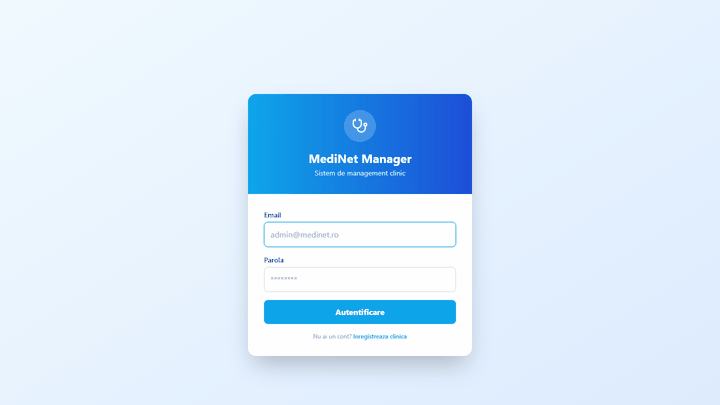

# Hi, I'm Bogdan Pricop

**Delphi, Node.js & SQL Server developer** building practical business applications and integrations.

I design and build full-stack solutions — from enterprise procurement systems to AI-powered tools — with a focus on clean architecture, real-world utility, and shipping fast.

---

## Featured Projects

### DeclaratiaTa — Romanian Tax Platform
> 15 ANAF declarations, 8 calculators, validation tools. The complete fiscal platform for Romania.

`TypeScript` `Next.js` `ANAF API`

<!--  -->

---

### AIR — Global Suggestion System
> AI-powered suggestion and feedback platform for enterprise teams.

`TypeScript` `React` `AI`


---

### ProcureFlow — Enterprise Procurement
> RFQ, Offers, Orders, Contracts, E-Auction, OCR — end-to-end procurement management.

`TypeScript` `React` `Express` `PostgreSQL`

<!--  -->

---

### MediNet — Clinic Management SaaS
> Medical, Dental & Veterinary clinic management. Multi-tenant, Docker-ready.

`TypeScript` `React` `Express` `MariaDB` `Docker`

<!--  -->

---

### EliCart — AI-Native Commerce Engine
> Headless commerce engine with AI built-in. TypeScript, Next.js, Hono, PostgreSQL, pgvector.

`TypeScript` `Next.js` `Hono` `PostgreSQL` `pgvector`


---

### Docker Dash
> Self-hosted Docker management dashboard — lightweight Portainer alternative. 80+ features: Sandbox Mode, AI diagnostics, GitOps, Swarm, CIS Benchmark, vulnerability scanning, multi-host, RBAC. ~50MB RAM, zero dependencies.

`JavaScript` `Node.js` `Docker` `SQLite`

[](https://github.com/bogdanpricop/docker-dash)

<!--  -->

---

### Delphi MCP Server
> The most comprehensive MCP server for Delphi development — 41 tools, IDE plugin, knowledge learning.

`TypeScript` `MCP` `Delphi` `AI`

<!--  -->

---

### LogicAI License Manager
> Centralized license management for SaaS, on-prem, Docker, and Delphi applications.

`TypeScript` `React` `Express`


---

### ClaimDesk — Claims Management
> End-to-end claims and complaint management system.

`TypeScript` `React` `Express`

<!--  -->

---

### RFQ Manager Pro
> Request for Quotation management — streamlined procurement workflows.

`TypeScript`

<!--  -->

---

### Overlay AI — Production Line Overlay
> Transparent information overlay for production lines on Windows. Built with Delphi VCL.

`Pascal` `Delphi` `VCL`

<!--  -->

---

### A4L Chat — Realtime Collaboration
> Realtime chat and collaboration platform.

`TypeScript` `WebSocket`

<!--  -->

---

### Prospects — Smart Sales CRM
> Sell more, smarter. Lead management and sales pipeline.

`TypeScript`

<!--  -->

---

### Bijoux CRM
> Customer relationship management for jewelry business.

`TypeScript`

<!--  -->

---

### Cafee Master
> Cafe and restaurant management system.

`TypeScript`

<!--  -->

---

### Prepress Flow Manager
> Prepress workflow automation and file management.

`TypeScript`

<!--  -->

---

### OmniBook — Appointment Manager
> Multi-tenant appointment scheduling system.

`TypeScript`

<!--  -->

---

### HQ Interactions
> Headquarters interaction and communication platform.

`TypeScript`

<!--  -->

---

### IdeeasForge
> Idea management and brainstorming platform.

`TypeScript`

<!--  -->

---

### App Portal
> Enterprise application portal — centralized access to all internal tools.

`TypeScript`

<!--  -->

---

### MedNet — Clinic Manager
> Clinical management system (earlier iteration).

`TypeScript`

<!--  -->

---

### Scale Manager
> Scale/weighing integration and management.

`Python`

<!--  -->

---

### EMS
> Enterprise management system with full operational dashboard.

`TypeScript` `React` `Express` `Docker`


---

## Open Source

| Project | Description |
|---|---|
| [docker-dash](https://github.com/bogdanpricop/docker-dash) | Self-hosted Docker dashboard — 80+ features, ~50MB RAM |
| [image_collector](https://github.com/bogdanpricop/image_collector) | Pro Image Collector |
| [d2bridge](https://github.com/bogdanpricop/d2bridge) | D2 Bridge utility |
| [WebStencilsDemos](https://github.com/bogdanpricop/WebStencilsDemos) | Embarcadero official WebStencils demo repository |
| [LifeGame](https://github.com/bogdanpricop/LifeGame) | Conway's Game of Life implementation |

---

## Tech Stack

```
Frontend     TypeScript, React, Next.js, Tailwind CSS
Backend      Node.js, Express, Hono, Delphi
Database     PostgreSQL, MariaDB, SQL Server, SQLite
AI/ML        OpenAI, pgvector, MCP
DevOps       Docker, Docker Swarm, GitOps
Desktop      Delphi VCL/FMX, Pascal
```

---

<p align="center">
  <i>Building tools that solve real problems.</i>
</p>
